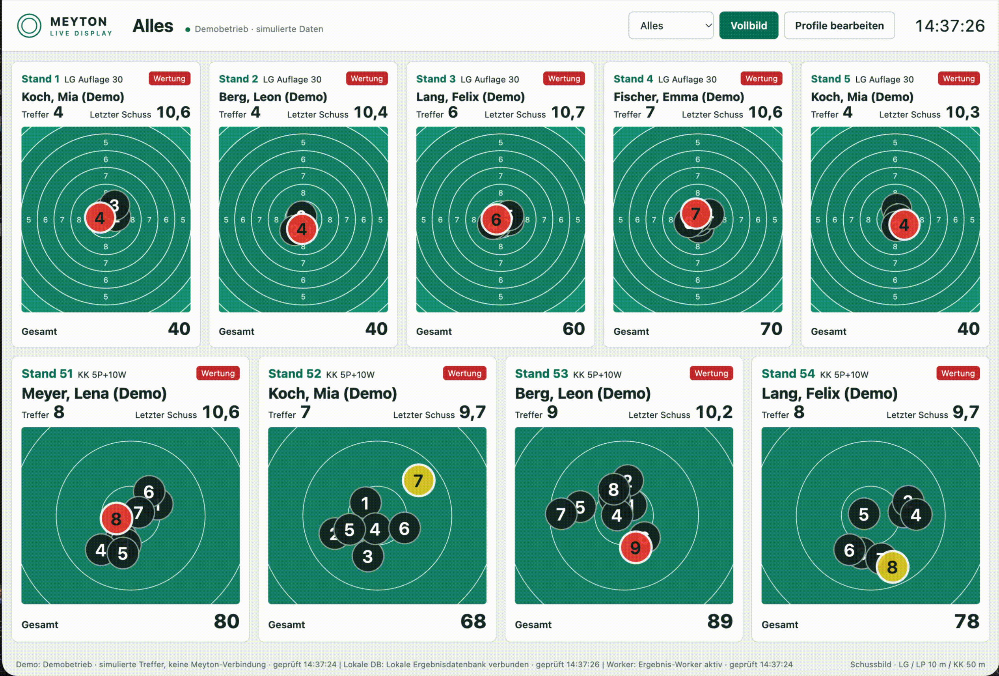

# Meyton Live Display



> **Notice:** This project is a vibe coding experiment.

Live shooting results for Meyton ShootMaster SSMDB2, displayed in a German-language browser interface. Use it on range screens, individual stand displays, or as an OBS browser source.

- Live target views with practice and scored shots, totals, and series.
- Editable display profiles, colors, layouts, and visible fields.
- Single-stand views and OBS modes with reduced screen controls.
- Sponsor images and optional text on empty stands.
- Optional resource-saver mode that reduces ShootMaster polling while idle or unattended.
- Docker deployment with persistent results and settings; a demo mode needs no Meyton connection.

> Intended for a trusted local network. Public displays show shooter names and results without authentication. Do not expose this application directly to the internet. Physical-shot latency depends on the vendor export and has not been independently verified across installations.

## Getting started

### Requirements

- Docker Engine with Docker Compose v2, or Docker Desktop with Compose.
- A Linux container host supporting `amd64` or `arm64`.
- For live results: access to the SSMDB2 database and the LANA live-occupancy interface; SDF ingestion additionally needs the SMB result share or a local SDF directory. Use read-only database and SMB accounts.
- SDF result export enabled in the Meyton Kontrollzentrum, unless using `SM_SDF_ENABLED=false` for DB-only results. See [side-by-side performance comparison](docs/technical-reference.md#compare-sdf-with-db-only-results).

### 1. Get the repository

```sh
git clone https://github.com/Meral-IT/Meyton-Live-Display.git
cd Meyton-Live-Display
cp .env.example .env
```

For an existing installation, keep your `.env` and Docker volumes; do not replace them with the example file.

### 2. Configure your installation

Edit `.env` and set:

| Setting | Purpose |
| --- | --- |
| `SM_DB_HOST`, `SM_DB_USER`, `SM_DB_PASS` | Read-only access to the ShootMaster database. |
| `SM_SMB_HOST`, `SM_SMB_USER`, `SM_SMB_PASS` | Read-only access to the SMB result share; optional with a local SDF directory. |
| `SM_ADMIN_PASSWORD` | A unique password for the profile editor. There is no generated or default password. |
| `DISPLAY_ADDRESS` | Hostnames or LAN IP addresses used to reach the display, separated by commas. Include `localhost` if used locally. |

For example, use `DISPLAY_ADDRESS=localhost, 192.168.1.50` if that is your Docker host's actual LAN address. Optional settings include database/share names, ports, time zones, and retention; see the [configuration reference](docs/technical-reference.md#configuration).

Generate an admin password, then copy the output into `SM_ADMIN_PASSWORD` in `.env`:

```sh
openssl rand -hex 24
```

Keep `.env` private. It is excluded from Git and Docker build contexts.

### 3. Start the published stable images

```sh
docker compose up -d --pull always --no-build
docker compose ps
```

This uses `latest` from GitHub Container Registry. Only the frontend exposes host ports: HTTP on 80 and HTTPS on 443 by default. Change `HTTP_PORT` and `HTTPS_PORT` in `.env` if those ports are occupied.

Open `http://localhost/`, or use your Docker host's LAN address. The display also supports HTTPS. The profile editor at `https://localhost/admin` requires HTTPS; use username `admin` and the password from `.env`.

A healthy container does not guarantee a working Meyton connection. Check the source status in the display. On a fresh installation, archived targets are not imported: results appear after new shots arrive. See [result collection and retention](docs/technical-reference.md#local-result-database).

When deploying on the central ShootMaster workstation, set `SM_SDF_DIRECTORY` in `.env` to the absolute path of its SDF export directory. In `compose.yaml`, uncomment the worker's `SM_SDF_DIRECTORY: /sdf` environment setting and the complete `/sdf` bind-mount block. SMB credentials can be left empty. Start normally:

```sh
docker compose up -d --pull always --no-build
```

The directory must already exist and be readable (including subdirectories and XML files) by container UID 10001. It is mounted read-only at `/sdf`; local files take precedence over SMB. Database and LANA access are still required.

### Optional custom logo

In the admin panel, use **Eigenes Logo** to upload or replace the top-left logo (PNG, JPEG, or SVG, up to 5 MiB). **Logo entfernen** restores the current title. The logo is shared by all displays and the admin page, persists on the existing `profiles` volume, and updates connected displays without a restart. Both pages share the same header height.

### 4. Trust the HTTPS certificate

Caddy creates a local certificate authority. In the profile settings, click **CA-Zertifikat herunterladen** to download its public root certificate. Before HTTPS is trusted, download it directly at `http://<Docker-host>:<HTTP_PORT>/meyton-root.crt` (default port 80). Alternatively, export it from the container:

```sh
docker compose cp frontend:/data/caddy/pki/authorities/local/root.crt ./meyton-root.crt
```

Install and trust this certificate on each viewing or OBS computer. On macOS, use Keychain Access and trust it for SSL. On Windows, use the Trusted Root Certification Authorities store. Restart the browser or OBS afterward. Never distribute the private CA key. Keep the Caddy volumes to preserve certificate trust.

HTTP serves the public display without redirecting to HTTPS. Opening `/admin` over HTTP redirects to HTTPS; admin API calls over HTTP are rejected.

## Try the demo

After creating `.env`, set `SM_ADMIN_PASSWORD` and `DISPLAY_ADDRESS` as above. Compose still requires nonempty database values, even in demo mode. For a new demo-only installation, use dummy values such as:

```dotenv
SM_DB_HOST=demo
SM_DB_USER=demo
SM_DB_PASS=demo
```

The demo worker does not connect to these hosts. Start it with:

```sh
docker compose -f compose.yaml -f compose.demo.yaml up -d --pull always --no-build
```

The display labels demo operation as `Demobetrieb`; fictional shooter names end in `(Demo)`. Edit profiles to change the simulated stands. `SM_DEMO_SHOT_INTERVAL` controls the average seconds between shots.

**Demo mode uses the same results and profile volumes as live mode.** Demo records retain their labels and remain until retention removes them. Use a separate installation for a demonstration if you need to keep an existing result database untouched.

To return to live collection, configure real source credentials and run:

```sh
docker compose -f compose.yaml up -d --pull always --no-build
```

## Display profiles and OBS

Fresh installations create these editable profiles. Existing saved profiles are preserved.

| URL | Default display |
| --- | --- |
| `/display/alles` | Stands 1–4 above stands 51–53. |
| `/display/luftgewehr` | Stands 1–4. |
| `/display/kleinkaliber` | Stands 51–53. |
| `/range/2` | A single stand; click a stand label to open this view. |
| `/admin` | Profile editor and sponsor management; HTTPS and login required. |

Use the editor to create, duplicate, preview, save, and delete profiles. Configure stand rows, colors, displayed fields, practice visibility, shot selection, and target zoom. Changes reach connected viewers without a restart. Sponsor images can include optional text and appear on empty stands. The global **Ressourcenschonmodus** can also be enabled there; its default 10-second idle polling interval is configurable without recreating containers.

Add `?profile=luftgewehr` to a single-stand URL to use that profile's appearance. Add `?obs=1` to hide operator controls or `?obs=2` to show only stand cards. With an existing query, use `&obs=2` instead.

For OBS, add a browser source with a URL such as `http://localhost/display/alles?obs=2` and a 1920 × 1080 viewport. Use the Docker host's address when OBS runs on another computer. OBS performs the streaming.

## Deployment guide

For a container-only installation on openSUSE Leap, see the [openSUSE Leap setup guide](doc/opensuse-leap-setup.md).

### Select an image channel or version

Both images support `linux/amd64` and `linux/arm64`. Worker and backend share `ghcr.io/meral-it/meyton-live-display-backend`; the frontend uses `ghcr.io/meral-it/meyton-live-display-frontend`.

```sh
# Stable channel
docker compose up -d --pull always --no-build

# Development prerelease channel
IMAGE_TAG=dev docker compose up -d --pull always --no-build

# Pin a released version; choose an available tag from GitHub Releases
IMAGE_TAG=0.1.0 docker compose up -d --pull always --no-build
```

Set `IMAGE_TAG` in `.env` to keep your selected version across commands. Image tags omit the Git tag's leading `v`. [GitHub Releases](https://github.com/Meral-IT/Meyton-Live-Display/releases) lists available versions. `latest` and `dev` move as new builds are published; explicit versions keep the backend and frontend on the same release.

`--pull always` refreshes moving channel tags, including `dev`. `--no-build` prevents a local source build from replacing a published image. These options are described in the [Docker Compose CLI reference](https://docs.docker.com/reference/cli/docker/compose/up/).

### Build from local source

The same Compose file supports source builds:

```sh
docker compose up -d --build --pull never
```

For a source-built demo, add `-f compose.yaml -f compose.demo.yaml` before `up`. `--pull never` applies to service images; Docker may still download Dockerfile base images and Python dependencies during a build.

### Update and operate

Back up results, profiles, sponsor files, and Caddy data before upgrades. Use the [backup and restore guide](docs/technical-reference.md#backup-and-restore).

Update your checkout with `git pull --ff-only` when you need new Compose or configuration changes. Review release notes, adjust `.env` if required, and run the deployment command for your selected channel or version. Environment changes require `docker compose up` to recreate affected containers; `restart` alone does not apply them.

```sh
docker compose ps
docker compose logs --tail=100 worker backend frontend
docker compose stop
docker compose start
```

`docker compose down` removes containers and retains volumes. **`docker compose down -v` deletes results, collection watermarks, profiles, sponsor images, and Caddy's certificate authority.** Changing the Compose project name also selects different named volumes, which can make an installation appear empty.

If an image pull fails, check the image name/tag and package visibility. Public packages support anonymous pulls. Private packages require `docker login ghcr.io` with package access and a token with `read:packages`. Do not remove `--no-build` merely to hide a pull failure.

If displays stay empty, check source status, network reachability, source credentials, SDF export, and whether a new shot has arrived since initial setup. For certificate errors, check `DISPLAY_ADDRESS` and trust the public CA certificate. See [commissioning and verification](docs/technical-reference.md#verification) for deeper checks.

## Technical documentation

[Technical reference](docs/technical-reference.md) covers architecture, configuration, Meyton source formats, occupancy, storage, API endpoints, backup/restore, verification, and release automation. The [SSMDB2 schema graph](doc/SSMDB2.graphml) remains under `doc/`.

## License

[Apache License 2.0](LICENSE).
